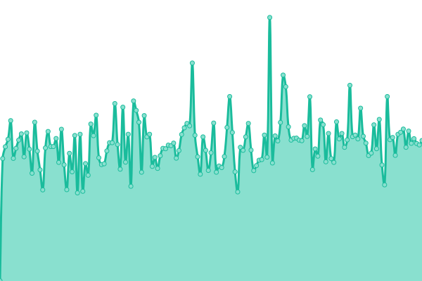
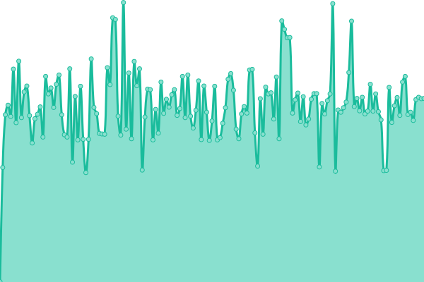
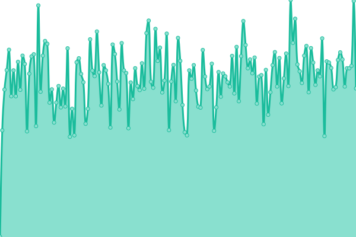

# [📈 Live Status](https://shin6949.github.io/uptime): <!--live status--> **🟧 Partial outage**

This repository contains the open-source uptime monitor and status page for [COCOBLUE](velog.io/shin6949), powered by [Upptime](https://github.com/upptime/upptime).

With [Upptime](https://upptime.js.org), you can get your own unlimited and free uptime monitor and status page, powered entirely by a GitHub repository. We use [Issues](https://github.com/shin6949/uptime/issues) as incident reports, [Actions](https://github.com/shin6949/uptime/actions) as uptime monitors, and [Pages](https://shin6949.github.io/uptime) for the status page.

<!--start: status pages-->
<!-- This summary is generated by Upptime (https://github.com/upptime/upptime) -->
<!-- Do not edit this manually, your changes will be overwritten -->
<!-- prettier-ignore -->
| URL | Status | History | Response Time | Uptime |
| --- | ------ | ------- | ------------- | ------ |
|  Home NAS | 🟩 Up | [home-nas.yml](https://github.com/shin6949/uptime/commits/HEAD/history/home-nas.yml) | 

 1084ms
     
 | 

<a href="https://shin6949.github.io/uptime/history/home-nas">100.00%</a>
    

|  Bookmark | 🟩 Up | [bookmark.yml](https://github.com/shin6949/uptime/commits/HEAD/history/bookmark.yml) | 

 826ms
     
 | 

<a href="https://shin6949.github.io/uptime/history/bookmark">99.72%</a>
    

|  Streaming Noti Service | 🟩 Up | [streaming-noti-service.yml](https://github.com/shin6949/uptime/commits/HEAD/history/streaming-noti-service.yml) | 

 624ms
     
 | 

<a href="https://shin6949.github.io/uptime/history/streaming-noti-service">99.69%</a>
    

|  Overlay Service | 🟩 Up | [overlay-service.yml](https://github.com/shin6949/uptime/commits/HEAD/history/overlay-service.yml) | 

 681ms
     
 | 

<a href="https://shin6949.github.io/uptime/history/overlay-service">100.00%</a>
    

|  Blog Service | 🟩 Up | [blog-service.yml](https://github.com/shin6949/uptime/commits/HEAD/history/blog-service.yml) | 

 665ms
     
 | 

<a href="https://shin6949.github.io/uptime/history/blog-service">100.00%</a>
    

|  Cloud AMD 1 | 🟥 Down | [cloud-amd-1.yml](https://github.com/shin6949/uptime/commits/HEAD/history/cloud-amd-1.yml) | 

 136ms
     
 | 

<a href="https://shin6949.github.io/uptime/history/cloud-amd-1">63.08%</a>
    

|  Cloud AMD 2 | 🟥 Down | [cloud-amd-2.yml](https://github.com/shin6949/uptime/commits/HEAD/history/cloud-amd-2.yml) | 

 136ms
     
 | 

<a href="https://shin6949.github.io/uptime/history/cloud-amd-2">63.09%</a>
    

|  Cloud ARM 1 | 🟩 Up | [cloud-arm-1.yml](https://github.com/shin6949/uptime/commits/HEAD/history/cloud-arm-1.yml) | 

 140ms
     
 | 

<a href="https://shin6949.github.io/uptime/history/cloud-arm-1">100.00%</a>
    

|  Cloud ARM 2 | 🟩 Up | [cloud-arm-2.yml](https://github.com/shin6949/uptime/commits/HEAD/history/cloud-arm-2.yml) | 

 140ms
     
 | 

<a href="https://shin6949.github.io/uptime/history/cloud-arm-2">100.00%</a>
    

<!--end: status pages-->

[**Visit our status website →**](https://shin6949.github.io/uptime)

## 📄 License

- Powered by: [Upptime](https://github.com/upptime/upptime)
- Code: [MIT](./LICENSE) © [COCOBLUE](velog.io/shin6949)
- Data in the `./history` directory: [Open Database License](https://opendatacommons.org/licenses/odbl/1-0/)
